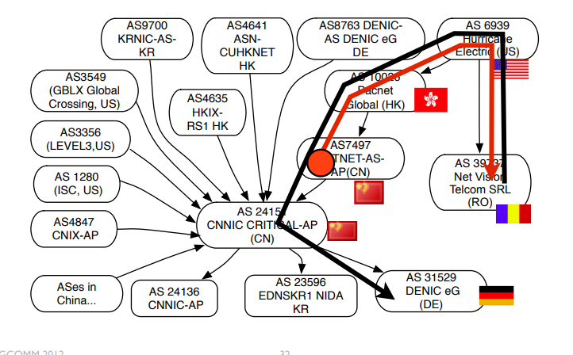
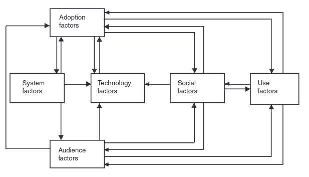
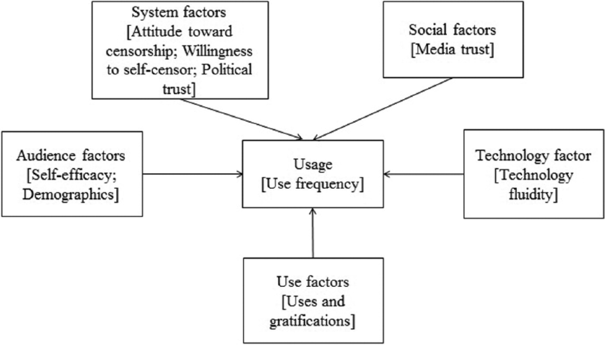

# 434 Paper

**Abstract** -- 
The (Great Firewall) GFW of China is a national scale firewall created by 
  the Chinese government for the purpose of controlling 
  and censoring information on the internet. 
The network layer of GFW is implemented using IDS technology in 
  filtering routers spread around the many AS-es in China.
At these filtering routers packets are inspected using four main mechanisms: 
  IP blocking, DNS poisoning, Keyword filtering and stateful traffic analysis.
The focus of this paper is to examine the mechanisms in use by the GFW 
  focusing on their implementation in network and transportation layer, 
  looking at flaws and main strategies of circumventing the GFW.

**Keywords** -- 
  GFW of China, IDS, IP blocking, DNS manipulation, URL filtering, 
  Keyword filtering, RST packets, Circumvention

## I. Introduction

*Across the **Great Wall** can reach every corner in the world.* \cite{01_hist1986} 
This email message sent to Karlsruhe University of Germany, 
from Beijing in September 1987, marks China’s entrance into the Internet. 
Ironically, as of December 2022, with 1.07 billion Internet users domestically,
\cite{02_stat2022} it would be nearly impossible to reach to anywhere on Internet 
without break across the GFW, the Great Firewall of China. 

The GFW comprises of intricate and multifaceted mechanisms,
  which ranges over technical, societal and political aspects. 
Beyond being a technical barrier, the Wall also includes legal ramifications 
  for those attempting to bypass it, 
  mandatory content regulations responsibilities for platform hosts,
  and a pervasive surveillance network that monitors digital footprints, 
    and subtly fabricating the psychological norms, 
    shapes thought and molds behavior of the users.

In this paper, we will talk about the technical aspects of the Wall, 
  and briefly discusses the main strategies of circumventing it.

## II. Operation of the GFW

Before covering the mechanisms used by the GFW, 
it is worth briefly covering how and where the packet monitoring is done 
to get a complete picture of the system.

### Structure of the GFW

AS-es (autonomous systems) can be divided into internal and border AS-es 
  where border AS-es communicate to foreign AS-es. 
Most of the filtering done by the GFW is done in the border AS-es \cite{03_whereFilter}
  where the request and response packets enter and leave the country,
  some filtering done inside internal AS-es \cite{03_whereFilter} as well.

Majority of the filtering is done in border AS-es, as it is the main concern on
  the network layer. 
  GFW's main work for domestic traffic is usually done in the application layer,
  through social engineering and state surveillance on hosting platforms and 
  the users, such as requiring content censors prior to publication 
  on all platforms, real-name registration of the users, and potentially legal
  repercussions for those who post illicit content, etc. \cite{04_digitalEco_mypaper}. 
  We would not cover these aspects in this paper.

Having filtering done in internal AS-es is also likely an efficiency measure as 
  having everything done in border AS-es could bottleneck the network so 
  mitigating some of the filtering into the interior AS-es can distribute the 
  the load more evenly.

An important note is that the GFW isn’t truly a wall in literal sense, 
  as the paths to nodes in China might experience different levels of filtering,
  and the list of conditions for a packet to be censorable would change over time
  (e.g. the term "Tiananmen Square" would rise in censorship around the
  anniversary of the 1989 protests in May and June) \cite{05_conceptDoppler}.

It is the case that the purpose of the GFW isn’t to create an impassable wall
 that prevents all foreign traffic, as it's technically infeasible and 
 economically destructive to do so, but more to instill fear and self-censorship
 and implicitly mold the online behavior with the sense of compliance.

Flaws and opportunities for exploitation exist for each level of filtering,
  if exploiting these flaws would lead to eventual policy change due to the 
  increasing cost of maintaining the GFW, or the increasing dissent from the
  citizens, or the increasing pressure from the international community; The
  circumvention tools would be the catalyst for the change. <x>07_taxonomy</x>

### How Packets Are Monitored

The packets in the internet traffic tracked by the GFW are monitored mainly with
  routers in various AS-es that equipped with IDS technology \cite{03_whereFilter}, which
  enables the routers to inspect incoming traffic using mechanisms to be discussed
  in the next sections.

Great amount of effort was put in the SDN, software defined networking, 
  which separated the control plane and the data plane in the routers, 
  this enables the routers to be more flexible and adaptive 
  to the changing conditions of the network, and to be able to update the 
  filtering rules in real-time. \cite{15_SDN}

When a packet satisfies the conditions for censorship, the most common case for the
  GFW is to send a TCP RST packet to both ends to terminate the TCP connection on
  both sides \cite{03_whereFilter}, triggering a denial-of-service attack prevent a pair
  of endpoints from communicating. Despite this, researchers have found it is 
  possible to *ignore* the spoofed RST packet and still receive the responses
  \cite{06_ignoring}.

```bash
iptables -A INPUT -p tcp --tcp-flags RST RST -j DROP
# or using BSD's ipfw
ipfw add 1000 drop tcp from any to me tcpflags rst in
```
[2.1 commands that ignores all RST packets]()

```log
cam(55817) → china(http) [SYN]
china(http) → cam(55817) [SYN, ACK] TTL=41
cam(55817) → china(http) [ACK]
cam(55817) → china(http) GET /?falun HTTP/1.0<cr><lf><cr><lf>
china(http) → cam(55817) [RST] TTL=49, seq=1
china(http) → cam(55817) [RST] TTL=49, seq=1
china(http) → cam(55817) [RST] TTL=49, seq=1
china(http) → cam(55817) HTTP/1.1 200 OK (text/html)<cr><lf> etc
china(http) → cam(55817) . . . more of the web page
cam(55817) → china(http) [ACK] seq=25, ack=2921
china(http) → cam(55817) . . . more of the web page
china(http) → cam(55817) [RST] TTL=49, seq=1461
china(http) → cam(55817) [RST] TTL=49, seq=2921
china(http) → cam(55817) [RST] TTL=49, seq=4381
cam(55817) → china(http) [ACK] seq=25, ack=4381
china(http) → cam(55817) [RST] TTL=49, seq=2921
china(http) → cam(55817) . . . more of the web page
china(http) → cam(55817) . . . more of the web page
cam(55817) → china(http) [ACK] seq=25, ack=7301
china(http) → cam(55817) [RST] TTL=49, seq=5841
...
```
[2.2 Example of ignoring RST packets]()

Note that the wall would also have the capability to track
  the ip addresses and the content of the packets, 
  and potentially the users who initiates the communications.

Also note that this experiment was done in 2006, and the GFW had its behavior
 since then, based on our experiment in 2024, the GFW would still send
 RST packets, but the most times, the rest of the content would be dropped.

Recent standards like HTTP/2 and QUIC would also make the GFW's job harder as 
  the encrypted and multiplexed nature of these transport layer protocols, 
  the wall would use alternative strategies to track the packets, including 
  deep packet inspection and stateful traffic analysis. The increased complexity
  increases chances of false negatives, yielding slightly lower blocking rates.
  We would discuss these findings in next sections.

## III. IP Filtering

IP filtering is the mechanism which has least operational cost and lowest level 
of granularity. \cite{07_taxonomy} 
If not administrated properly, 
it would result in high false positive and false negative rates. Where:

- **False Positive**: Legitimate traffic is blocked.
This mostly happens to multiple sites are hosted on a shared IP address,
  when blocking one site, all other sites on the same IP would be blocked
  disregarding the content, causes unnecessary collateral damage, including
  potential impact on the economy and innovation.
- **False Negative**: Site that is deemed to be blocked is not blocked,
This mostly happens when the site is hosted on a dynamic IP address, 
  or the site is hosted on a CDN.

The IP Filtering is applied as first layer of defense, such as sites that have
  a fixed IP address such as google.com or US Senate. 

It is also applied to be a last resort, when other mechanisms fails to block
  the traffic, this is essentially the case to deal with the use of VPNs as
  a circumvention tool, in combination with active probing.

### Implementing IP Blocking

IP blocking, including other filtering mechanisms, is introducing *black hole*
  in the network which drops the packets silently once the ip is recognized as
  a blacklisted ip.

The routers would need a list of banned IP addresses, to adapt to the dynamic
  nature of the internet, the list would be updated periodically, 
  and the routers would be able to update the list in real-time.

One implementation is have a central database with entire list of banned IPs, 
  and with the knowledge of complete network topology within the country, 
  it would distribute the entries to routers in a way that both balances the
  load and ensures consistent filtering. The per-router distribution would also
  rotate the list to avoid bottleneck and synchronization issues.

TCP wrapping is a common method to implement IP blocking, where the routers
  would have a list of rules to block the IP addresses, and the rules would 
  be updated periodically. The rules would be in shape of files in `/etc/hosts.deny`
  and `/etc/hosts.allow` files, constituting a blacklist and whitelist respectively.


In this sample entry of `/etc/hosts.deny` file, the rule is to block the IP address
  that is trying to connect to the host. The rule is in shape of `daemon: client: options`
  where the daemon is the process name or wildcard that the client is trying to connect to,
  the client is the address, host name, 
  or wildcard to represent the client attempting to connect. \cite{12_hostman}

The rule in figure 3-2 shows the block of IP 100.100.100.100. The rule states 
  that all processes that the IP address tries to connect to should be denied,
  making TCP connection impossible to establish. Adding this rule to the 
  `/etc/host.deny` file would IP block the address 100.100.100.100 within the 
  network


On the BGP level, the routers are configured to drop the packets from matched
  IP addresses, such black-holed IP addresses involves 3 steps: \cite{13_blackhole_cisco} \cite{14_blackhole_rfc}
- **Setup (preparation)**: A trigger is a special device that is installed at the NOC 
  (Network Operations Center) exclusively for the purpose of triggering a black hole. 
  The trigger must have an BGP peering relationship with all the edge routers, and is
  configured to redistribute static routes to its BGP peers, sends the static route by
  means of an BGP routing update.

  The Provider Edges (PEs) must have a static route for an unused IP address space. 
  For example, 192.0.2.1/32 is set to Null0 (which is not used as a deployed IP address)

  Loose URPF (Unicast Reverse Path Forwarding) is configured on all external facing 
  interfaces of PEs.

- **Triggering**: When an administrator adds a static route to the trigger, 
  which redistributes the route by sending a BGP update to all its BGP peers, 
  setting the next hop to the target destination address (192.0.2.1 in this case)

  Each PE receives an BGP update and sets its next hop to the source IP to the
  unused IP address space 192.0.2.1. The next hop to this address is set to Null0
  using a static routing entry in the router configuration. The next hop entry
  in the FIB (Forwarding Information Base) is updated to point to Null0.

  All traffic from the source IP will fail the loose URPF check at the PEs and 
  as a consequence will be dropped.

- **Withdrawal**: Once the trigger is in place, all traffic from the source IP
  address will be dropped at the PEs. If it removed from the black list, the
  administrator would manually remove the static route from 
  the triggering device, which sends a BGP route withdrawal to its BGP peers.
  This prompts the edge routers to remove the existing route for the source IP
  that points to 192.0.2.1 and to install a new route in the FIB based on the
   IGP (Interior Gateway Protocol) RIB (Routing Information Base) entry.
  If this new route is successful, loose URPF will pass and traffic will be
  forwarded normally.

This implementation comes with 2 flavors of black hole filtering: 
  Destination-Based and Source-Based. Above describes a source-based approach
  but the destination-based approach is similar, excepting the criteria for 
  black hole a packet is the destination IP address.

In a scenario of, when Alice, a university student, attempting to querying 
  some blacklisted terms through a search engine somewhere outside the country.
  The GFW intercepts the query and may deemed that the search engine
  or the user should be punished. <x>16_censorPerspectives</x>

When encountering the source-based black hole, all packets returned from the 
  search engine would be dropped, and Alice would not be able to receive the
  search results. The search engine would not be aware of the black hole, 
  and would continue to send the packets, which would be dropped at the border.
  Other sites hosted on the same IP address would also be blocked.

When encountering the destination-based black hole, Alice's IP (since she is in
  the university network, the BGP would not recognize Alice's IP over the 
  university's NAT, but take the university's IP address) would be black holed.
  All packets across BGP into that university would be dropped.
  All the sudden her entire dorm would not be able to connect to most of the 
  sites hosted outside of the country, for a while until the administrator 
  removes the ban. (Usually within a short period to avoid too much 
  collateral damage)

The later is often been regarded as a punitive measure, and shifts the blames 
  of entire university's network inaccessibility to Alice for *running into the
  wall*, and would be a warning to other students to avoid similar behavior.
  The practice of *collective punishiment* is not uncommon in China since very
  ancient times to extend the legal actions beyond the individual, and thus 
  strengthen the social control. \cite{17_earlyChina}

The blacklist strategy is more common in the GFW, although whitelist strategy is 
  possible and has been used in the past, such that after 2009 Urumqi riots,
  internet access was blocked in Xinjiang in a way that only less than 100 
  local sites, such as banks and local government sites were accessible. \cite{10_missingLink}
It lasted for nearly a year, \cite{11_xinjiang}
  damages to the economy, society and people's social life were immense.

### Flaws in IP Blocking

In the case of IP blocking, the flaw would lies in their false-positive and 
  false-negative rates, being effective and finale itself, certain oversites
  would defeat its purpose.

Since the IP blocking is limited only to a specific IP address, 
  the earliest circumventing attempts are proxied access, this does not
  necessarily mean using a VPN. Some early circumvention strategies features
  using a proxy over HTTP which is generally supported by most browsers and
  applications. \cite{18_GFWSpaceTime}

Also, even for a single site, it is likely to host on CDN and the IP address
  would be dynamic, the GFW would have to update the list frequently to keep
  the site blocked. (Or, block the entire CDN, which the collateral damage 
  would be substantial. As of 2023, many CDN are affected by the GFW. \cite{19_detect})

Being the cheapest option on the list, it essentially is not scalable to 
  block all the sites, to keep up with the dynamic nature of the internet, 
  maintenance of such list would mean a large amount of human resources and 
  technical overhead. Let alone of the indirect economic impacts.

Tools with minimal configuration and cost would be enabled to bypass the IP
  blocking, and the GFW would have to rely on other mechanisms to keep up with
  the circumvention tools.

The mechanism of over-blocking can be abused by groups or individuals 
  to vandalize the network, such as compromising competitor's network via 
  weaponizing censorship infrastructure, constitutes availibility attack;
  or to disrupt the network constantly that the cooperating parties would be
  annoyed, increase dissent and therefore defeat the purpose of the GFW.
  (Although the existence of GFW is self-defeating in the first place)

## IV. DNS Manipulation

Due to the majority of DNS request is over UDP, which tends to lack verification
  and encryption, DNS request are very vulnerable to hijacking and spoofing. 
  \cite{20_dnsUDP}

Part of the GFW is consisted of liar DNS servers and DNS hijackers returning 
  incorrect IP addresses. 

At these server DNS, manipulation can be done where instead of returning the 
  actual IP address for a result or relaying it to another DNS server, the 
  servers would reply with either a non-functional IP address or with IP address
  of another website (e.g., leads to the site of local police department).

Evidences suggests that the DNS filtering is keyword based \cite{21_dnsCompreh}
, this would implicitly
  solve the problem of mirror url for the same content, and the DNS manipulation
  would be able to block the entire domain, including all subdomains and the 
  content hosted on the domain. 

Because those domestic DNS servers are topologically
  and geographically closer to the users, the uses would be directed to the 
  compromised addresses before the upstream can respond to the query. 

### Implementing DNS Manipulation

Usually, DNS servers stores DNS records for recently accessed hosts in cache.
  If a record is in the cache, then the server would return the record directly
  as there is no need to query the record from the authoritative server again.
\cite{22_dnsConcpets} Unless the record is expired, the server would query the
  upstream servers for the record of actual IP address.
  Most general DNS records are in the form of A and AAAA records, which stores
 IPv4 and IPv6 addresses respectively. 


DNS poisoning happens when the cache inside a server has been modified so that
  it returns the wrong IP address without validating the record with the 
  authoritative server. This is a common attack vector for redirecting users to
  malicious sites, and the GFW uses this mechanism to block the access to 
  certain sites.


In example with the Figure 4-2, the DNS cache poisoning would be done by 
  directly implanting fake DNS records into the cache of the DNS server.
  With the state-owned ISPs, DNS relay is compromised and the DNS records are
  all poisoned. Existing verification means such as using TTL on the DNS records
  are not effective, compares to a 3rd party DNS spoofing attack, where an 
  individual attacker usually have temporary access to few servers;
  the affected DNS server, and all downstream and domestic servers 
  are state-controlled. Conventional verification is futile. <x>23_dnsMeasure</x>

### Flaws of DNS Manipulation

Avoiding the compromised DNS servers in first place would be the most effective
  way to bypass the DNS manipulation.

For example, systems using systemd would be able to use `systemd-resolved` to
  edit `/etc/systemd/resolved.conf` to add entries that override the default
  DNS. This would allow the system to use a different DNS server that is trusted.
  Note that due to the recursive lookup feature, the DNS server need to ensure
  that all upstream are from clean sources too.

Directly typing the IP addresses in browsers would also bypass DNS manipulation.

Recent moves towards DNS over HTTPS (DoH) and DNS over TLS (DoT) would also 
  make the DNS manipulation harder, as the DNS request and response would be
  encrypted and the upstream DNS server would be able to verify the authenticity
  of the DNS records.

The problems still ensue as
1. The ISP can just deny providing the service to the user who uses DoH/DoT.
2. Opportunities of sidechannel attacks still exist to detect anomalies in the
  encrypted traffic.

Note that the *poison* in the tampered servers infers that, those compromises 
  would have propagating effects due to the recursive nature of DNS lookups.
  In 2012, internet groups has found out that with 39 AS-es in China injecting
  forged DNS replies, open resolvers outside China distributed in 109 countries, 
  suffer some collateral damage from those forged replies,
  3 TLDs affected almost completely (99.53%, domains from within GFW, expected),
  and 11573 resolvers affected (26.4%) or 1 out of 16 unexpected TLDs. 
  (`de xn--3e0b707e kr kp co travel pl no iq hk fi uk jp nz ca`)
  As some paths between resolvers and some TLD (Top Level Domain) name servers 
  transit through (affected) ISPs in China. <x>24_dnsGlobal</x>



Figure 4-3 shows a path where a `.de` TLD is poisoned, via its transit in 
  CN (China) AS 7497 and AS 24151

## V. Survey of Circumvention Tools and Strategies

Various circumvention tools have been developed to bypass the GFW, 
  gradually increasing in complexity, with trade-offs among dimensions of: 
  \cite{07_taxonomy}

 1. *Availability*: 
 there is no use of an anti-censorship technology if 
 the target users cannot acces it.

 2. *User-friendliness*: 
 an often under-explored dimension, 
 given the large population of users who are not technology-savvy.
 
 3. *Verifiability*: 
 how can a user verify that the software is not a monitoring tool 
 from the government.
 
 4. *Scope*: how many modes of communication can be covered.

 5. *Security*: this is the most obvious dimension of an anti-censor.

 6. *Deniability*: if caught, how can a user deny her involvement.

 7. *Performance*: how much will throughput and delay be 
degraded by using the anti-censor. 

Those aspects often has trade-offs against each other, 
e.g., scope-deniability vs performance-availablity, userfriendliness-denialibilty.

Just like the censorship system, the anti-censorship tools also comes in
  multiple components targeting different layers of the network stack that
  works together to bypass the censored network, most times corresponding to
  a specific censorship mechanism. 
e.g., secured alternative messaging application to ones raised security concerns
  (e.g., Signal, Telegram, etc), alternative DNS server for DNS manipulation, 
  VPN or HTTP proxy for IP blocking, and encrypted tunnel for DPI and 
  obfuscation for stateful traffic analysis. \cite{48_globalDefeat}


Note that supporting the circumvention tools might involve out-of-band 
  communication channels such as hidden part of CD/DVD, floppy disks, USB drives, 
  or QR codes, URL and barcodes as printed materials, also includes word-of-mouth.



As figure 5-2 \cite{49_ICTAdopt} addressed the people's adoption of most ICTs,
  it is consisted on the spectrum from micro-individual to macro-social poles:
  with factors in aspects of *system, technology, audience, social, use, adoption*



Similar pattern (figure 5-3) \cite{47_circumvention} would apply to 
  circumvention tool use, with more weights on
  how each other factors would affect the usage, then usage would also have
  a reciprocal effect on the other factors. 

Noting that each of those factors are important in their own right,
  the scope of rest of this paper would focus on the technical aspects of the 
  circumvention tools, and how they interact with the GFW.

There are three commonly used circumvention methods that works together to 
  bypass the GFW: \cite{07_taxonomy}
- HTTP/CGI proxy
- VPN (IP tunneling)
- Re-routing
- Distributed Hosting

### HTTP/CGI Proxy

HTTP proxying sends HTTP requests through an intermediate proxying server, the
  client would send exact same HTTP request to the proxy as if it is send to 
  the target server. The proxy server may re-parse the HTTP request, and sends
  its own HTTP request to the target server, then returns the response back to
  the proxy client.

CGI proxy, on the other hand, is a bit obfuscated, it uses a server-side script
  to perform proxying function. A CGI proxy client sends the requested URL as 
  payload embedded in the data portion of an HTTP request to CGI server. 

The CGI server then pull out the intended target information from the payload,
  and sends the request to the target server, then returns the response back to
  the CGI client.

Those are seen more primarily in the older systems, such as *Freenet* (1999),
  *UltraSurf* (2002), *DynaWeb* (2002), which mainly uses HTTP proxy, and 
  *Psiphon* (2006) which uses CGI proxy.

Each has its own issues such as limitations and dependencies on the client 
  software, and it was designed when GFW was at its infancy, later added features
  (such as addition of DNS hijacking) would render these tools ineffective.

The ideas of HTTP/CGI still leaves a legacy in more modern circumvention tools.

### Re-routing and Distributed Hosting

Re-routing systems route data through a **series** of proxying servers,
  encrypting the data again at each proxy, so that a given proxy knows at most
  either where the traffic came from or where it is going to, but not both.

*Tor* (2002) is the most famous and long-lived re-routing system, 
  which routes the data through a series of volunteer-run nodes.

However, *Tor* is not a accessible in China since around 2015, it is lately
  known that TOR's obfuscation leaves a fingerprint that is possible to be 
  detected. (e.g., fixed packet size, fixed packet interval, etc) Even it is
  hard to decipher the content of the packets, the fact that it is a TOR packet
  is enough for such traffic to be blocked. \cite{50_tor_finger} The SDN 
  topology of the GFW has separate nodes that is each specialized at high-efficency
  relaying and traffic analysis. Similar to the remotely triggered black hole
  model, the analysing node triggers the blocking node to block the TOR traffic.

Usability and QoS issues also makes the TOR less attractive to the general
  public, combined with social engineering and legal repercussions as deterrents,
  users are less likely to participate in the TOR network. 

On the other hand, the GFW is scaling up by with increasing control 
  and higher computation power, with the decreasing number of participants 
  in P2P networks, it is not surprising that the peers in such networks are
  likely to be state-controlled.

Distributed hosting is more of a server effort than client effort, and usually
  for the purpose of mitigating DDoS and single-point-of-failure issues.
  It is effective against ip blocking.

However, depending on the CDN, there are cases that entire CDN is blocked 
  by the GFW, such as github was not blocked but had connection issues in China, 
  as its CDN, *Fastly*, was blocked. \cite{19_detect} 

At another case, CDNs might chose to practice geo-block due to economical
  pressures. In 2018 researchers found that many CDNs had server-side blocking
  with China, Iran, Syria, Sudan, Cuba, Russia and North Korea. \cite{51_CDN403}

### Tunneling

As of today, the most common circumvention tool is use of a VPN tunneling with
  self-hosted VPS or commercial shared VPN services.

The user usually purchases a (virtual) machine in a place without censorship
that can be accessed remotely, and installs tunneling software 
(e.g., openSSH, etc.) on the machine. 

For each session where the user needs to access uncensored content, the user 
  would establish a SSH connection to the machine, and set up a SOCKS proxy 
  on the client side, then redirect partial or all of the traffic through the
  tunnel to their VPS, then the VPS would relay the request and response between
  the client and the target server as a bridge.

It is by far the most effective and secure way to bypass the GFW, since the 
  VPS tends to be privately owned, and the traffic is encrypted end-to-end.
  Taking down one VPS would only affect the users on that VPS, but it is 
  relatively cheap to switch to another VPS, compares to the increasing overhead
  of the GFW to block all the VPS-es.

The only known way for the GFW to confronting it is to perform deep packet 
  inspection and traffic analysis that recognizes the traffic pattern within 
  the tunnel, and block the source IP address of the VPS. 
  (we are excluding the social-engineering and legal repercussions in this paper)

**Shadowsocks** (2012) is an open-sourced SOCKS protocols framework that is 
  popular in China. It has many open-source forks in various languages 
  \cite{36_SS-py} \cite{37_SS-rust} <x>38_SS-go</x> <x>39_SS-cs</x>.  
According to a research survey in July 2015, of 371 faculty members and students 
  from Tsinghua Univer-sity, 21% used Shadowsocks to bypass censorship in China.
\cite{50_googleScholar}

The popularity of Shadowsocks stems from its simplicity. 
Its lightweight design imposes minimal overhead on proxied traffic and 
  makes it easy to implement on a variety of platforms. 
A large, profit-incentivized proxy reseller market, 
  as well as numerous tutorials and one-click installation scripts, 
  have reduced the difficulty of installing and using Shadowsocks, 
  and made it popular even among non-technical users.

Researchers found that the GFW utilizes an *active probing* mechanism to 
  detect the Shadowsocks traffic, and then block the source IP addresses of 
  the VPS-es. \cite{40_SSProbe} Still, the blocks are only anecdotally reported,
  and continuing development of Shadowsocks to improve its encryption and 
  obfuscation with community efforts. 

### Novel Protocols

Recent developments and adoption of novel protocols such as QUIC, HTTP/3 and IPv6
  would also make the GFW's job harder, as the multiplexed and encrypted nature
  in the transport and network layer make it harder to track traffic states, 
  also increases the problem space exponentially for rule-based filtering.

#### QUIC+HTTP/3

**QUIC** (Quick UDP Internet Connections) is a transport layer protocol was designed
  to provide secure, consistent, and low-latency connections over the internet.
  A secure connection resembling DTLS (Datagram Transport Layer Security) is
  running atop UDP and multiplexes multiple streams over the same connection.
<x<>@54_QUIC</x>

**HTTP/3** is the 3rd major version of HTTP used to exchange information on the
  WWW. HTTP/3 is based on QUIC, and is designed to improve the performance of
  the web, especially for mobile devices. \cite{55_HTTP3}

The introduction of HTTP/3 (HTTP over QUIC) yields promising expectations 
  to counteract such interference, due to its novelty, build-in encryption, 
  and faster connection establishment. QUIC's methods of IP address discovery
  should also make it harder to spoof. 

Researchers in 2020 conducted a study on the effectiveness of the GFW to block
  QUIC traffic, found that for AS-es which has high failure rate on TCP connections
  (TCP-handshake timeout and connection reset), yields a significantly lower 
  failure rate on QUIC connections. \cite{53_quicBlock}

The same research also suggests that IP blocking is the primary causation of the
  failing QUIC connections. Since the censor does not exclusively apply IP 
  endpoint blocking, hosts that are targeted by a different form of HTTPS 
  censorship are still available over QUIC.

The adaptation of IPv6 would also make the GFW's job harder, as the IPv6 address
  space is significantly larger than IPv4, and the GFW would have higher
  operational overhead to keep adding more entries in the blacklist, and also
  meant easier allocation for individual users to have their more VPSs 
  in the IPv6 space.

## VI. Keyword Filtering, Deep Packet Inspection Stateful Traffic Analysis and Evolution of GFW

Where conventional blocking criteria are based on protocol's header information,
  GFW evolves to use novel methods that inspect and analysis the payloads as well.

When deemed that the cost of false negative for oversighting of information is 
  more emergent issue than potential loss of false positives, but more are the
  cases that different parties of a authoritarian government fails to coordinate
  with each other. Such as Iran blocks all UDP traffic. \cite{53_quicBlock}

Various advanced methods are applied with the SDN topology of the GFW, which
  separates the concerns for high-efficiency relaying blocking (packet drop)
  nodes (data panel), and mirrors the traffic to real-time traffic 
  analysis nodes (control panel), those nodes then signal instructions to the 
  data nodes to block the traffic or not. 

However, various traffic analysis is only been found in the case where a node
  relays the traffic 

### Fingerprinting

For some encrypted and obfuscated traffic, such as TOR, even the payload are not
  easily readable, the traffic would still have side-channel vulnerabilities,
  such as the fixed packet size, fixed packet interval, and entropy of the 
  packets. \cite{50_tor_finger} \cite{56_gfwTOR} \cite{57_blockingTor}

In particular, Tor (in 2012), has a TLS client `hello` in the Tor cipher list, 
  with the purpose of initiate a TLS connection.

```log
c0 0a c0 14 00 39 00 38 c0 0f c0 05 00 35 c0 07
c0 09 c0 11 c0 13 00 33 00 32 c0 0c c0 0e c0 02
c0 04 00 04 00 05 00 2f c0 08 c0 12 00 16 00 13
c0 0d c0 03 fe ff 00 0a 00 ff
```
**Listing 1.1.** Tor cipher list inside TLS client hello.

It is one of the few unique features of Tor traffic that can be used to 
  fingerprint the traffic, and the GFW uses this feature to locate Tor traffic.

Fingerprinting is also the mechanisms where the routers recognizes anomalies
  in the traffic pattern, \cite{26_gfwSS2020} once this is detected, probes 
  will be send to server or the client for further attack gaining more data
  to confirm the anomaly, and then block the traffic. (usually done in a
  **replay attack**)

### Active Probing and evolutions

In case of Shadowsocks, the GFW uses an active probing mechanism to detect the
  Shadowsocks traffic, and then block the source IP addresses of the VPS-es.

The study in 2020 set up sets up series of experiments which attracts
 the active probs from GFW.
They studied the behaviors and fingerprinted certain traits
 of probes sent by GFW, including IP origin, AS origin, and TTL values.

Compares to similar study done in 2015 \cite{46_gfw-discover}, there are few
  more traits that indicates the wall became stronger during the 5 years, in
  terms of the active prober, which it is less likely to be recognized as a 
  probe, and more likely to be recognized as a normal request.

| Trait | 2015 | 2020 |
|-------|------|------|
| IP ID | no pattern | no pattern |
| TTL | centered around 47-50 | centered around 46-50  |
| TCP source ports | distribute across 16 bit space, including under 1024 | 90% around 32768-60999, none below 1024 |
| TCP timestamp (from SYN) | 250 Hz - 1 kHz | 250 Hz - 1 kHz |
| **Source IP** | **16464 probes with 15249 addresses** | **51837 probes with 12300 addresses** |
| **replays** | **Little variation** | **systematic variation** |

Noticibly, the two source IP has a very small overlap (167 out of 3500), suggesting
  possible more dense probing nodes, or the GFW is gradually increasing the number
  of probing nodes.

Also, in terms of **replay attacks**, where nearly no variation is found in the 2015
  study, the 2020 study found a systematic variation in the replay attacks, 
  in ways that changing certain bits as a trait group for OutlineVPN and other
  set of change for ShadowSocks and for Tor. Also, there is a noticeable **state-
  transition** in which types of the replay attacks are used.

The study also found that **packet length** as a fingerprinting trait to identify
  ShadowSocks and other tunneling traffic, as well that a high-entropy payload
  is more likely to gain attention, as a packets with a per-byte entropy of 7.2
  is 4 times more likely to be probed compared to a packet with entropy of 3.0.

By analyzing the behavior before and after an VPS is blocked by the
 wall, there is a theory of machine-scanned registry of the VPS black-list (gray?)
and human-administrated block-lists, and unblockings.

An adversary model is proposed:

1. GFW passively recognizes certain traffic pattern are likely to be 
   circumvention tools,

2. Probes are sent to the suspected VPS for confirmation, 
   primiarly uses the Replay.

3. The VPS are likely to be marked on *Black/Gray List*, 
   and faced blocking by adminstrators at any future time.

### Social Engineering 

While in the attempt of demystifying the GFW, we might be underestimating or
  overestimating the technical capabilities of GFW, it is entirely feasible 
  that the deep-learning based traffic analysis is just a rumor, as the GFW
  tends to rely on the state-controlled violence and social engineering to 
  achieve the same goal.

Around the same time where the developer and maintainer posted the possible
  solutions to redirect the replay attacks to other http sites, 
  and improving the cipher being used, and ready to deploy the new version
  of the Shadowsocks, the state police found the maintainer and the repo was
  *voluntarily* deleted by the maintainer, *clowwindy@GitHub*. \cite{58_breakwaIssue}

Again, as many would argue, the GFW is not a technical problem, but a social
  problem, and the social engineering is the most effective way to defeat the
  GFW, as the GFW is not a monolithic entity, but a collection of individuals
  with different goals and motivations.

